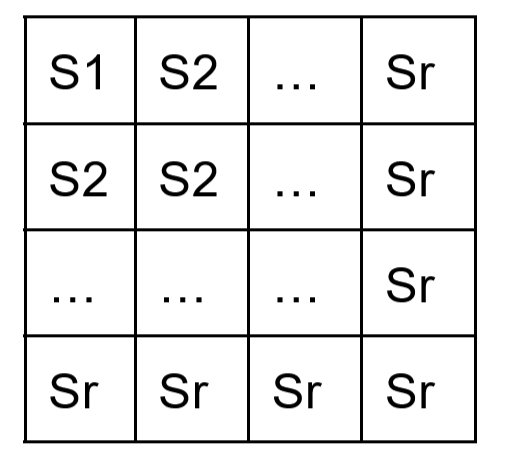
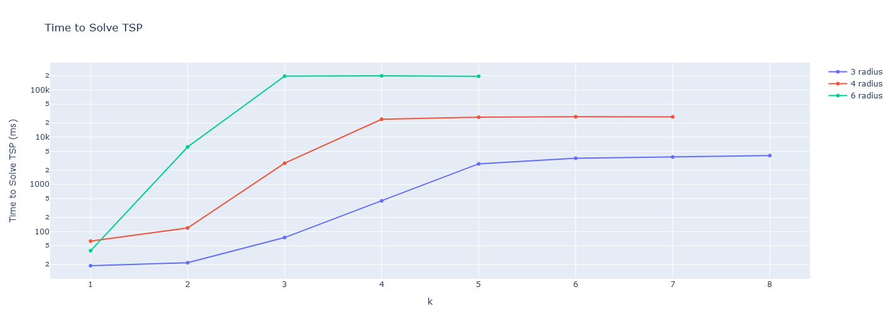
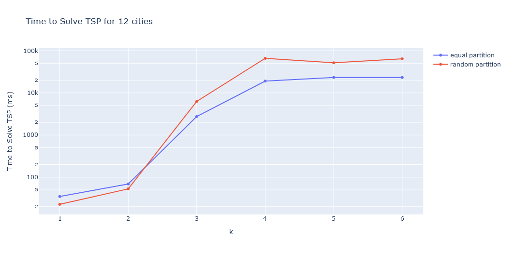
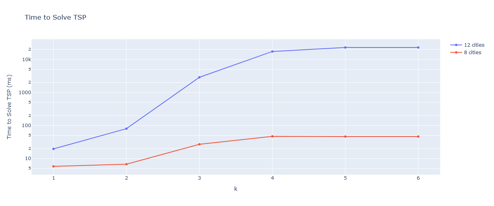
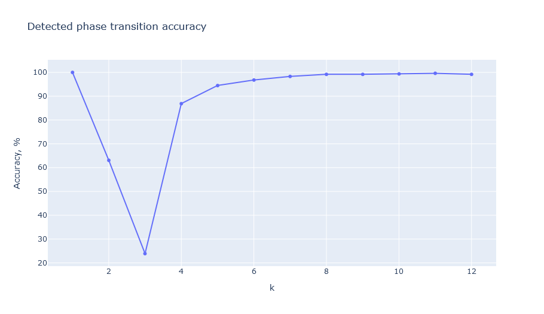
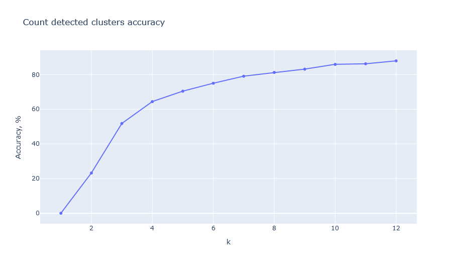
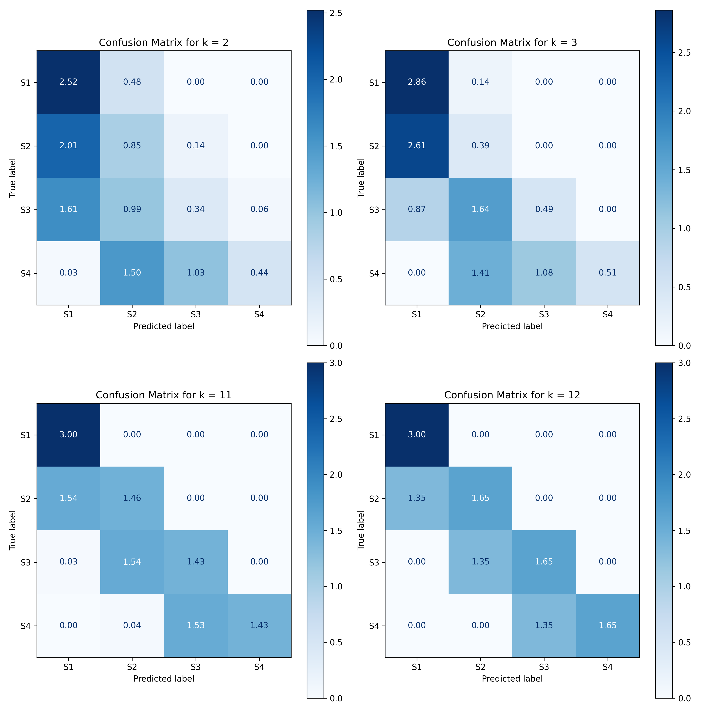

# Определение фазового перехода в NP-трудной задаче коммивояжера.

Ключевые слова: NP-трудная задача, фазовый переход, задача коммивояжера (TSP), ассиметричная задача коммивояжера (ATSP).

## Аннотация
В представленной статье разработан прототип библиотеки определения фазовых переходов в задаче коммивояжера (TSP) на языке Python. 
Выполнен обзор библиотек, использование которых способно привести к решению поставленной проблемы, с целью выявления их достоинств и недостатков. 
В ходе анализа определены критерии сравнения аналогов с различными подходами к решению задачи: решаемый тип задачи, применимые методы, ограничения на размеры данных, масштабируемость. 
Была разработана математическая модель определяемого фазового перехода и исследованы его характеристики. 
На основе результатов сравнения аналогов и исследованных характеристик определяемого фазового перехода был разработан алгоритм по его определению с использованием современных инструментов для научных вычислений и машинного обучения. 
Разработанный прототип библиотеки поддерживает модульную архитектуру, допускающую расширение функционала, адаптацию для анализа других типов фазовых переходов, а также дальнейший перенос вычислений на GPU. 
Представленный прототип закладывает основу для разработки универсального инструмента анализа фазовых переходов в задачах класса NP, что открывает перспективы для дальнейших исследований и практического применения.

## Введение
Не все задачи в области вычислительной теории могут быть решены за полиномиальное время. Существует подкласс задач, известных как NP-трудные задачи, которые требуют экспоненциального времени для нахождения решений [1, 2]. К числу таких задач относится и задача коммивояжера. Ситуация усугубляется наличием фазовых переходов, которые возникают в NP-трудных задачах. Фазовые переходы представляют собой резкое увеличение сложности решения задачи в зависимости от изменения контрольных параметров, что  исключает возможность получить точное решение [3, 4].

Объектом исследования данной работы является NP-трудная задача коммивояжера, в то время как предметом исследования выступает определение фазовых переходов в NP-трудных задачах. Цель данной работы заключается в разработке прототипа библиотеки для определения наличия и типа фазовых переходов в NP-трудной задаче коммивояжера на основе анализа входных данных. Для достижения поставленной цели были поставлены следующие задачи:

1. Обзор существующих инструментов определения фазовых переходов.
2. Определение критериев сравнения инструментов определения фазовых переходов.
3. Сравнение выбранных инструментов по выбранным критериям.
4. Разработка математической модели, описывающей определение фазового перехода в TSP.
5. Реализация определения заданного фазового перехода на основе описанной математической модели.

Задача коммивояжера имеет множество практических применений, включая логистику, маршрутизацию, планирование, оптимизацию производственных процессов и т.д. Возможность выявления наличия и типа фазового перехода предоставит возможность выбора более эффективного алгоритма решения задачи в условиях конкретного фазового перехода.

### Постановка задачи коммивояжера
Задача коммивояжера (TSP, Traveling Salesman Problem) [5] — это одна из классических NP-трудных задач комбинаторной оптимизации. В задаче рассматривается набор городов, связанных дорогами, и требуется найти кратчайший путь, который проходит через каждый город ровно один раз и возвращается в начальный город.

В данной статье рассматривается наиболее общий случай, а именно ассиметричная задача коммивояжера (ATSP, Asymmetric Traveling Salesman Problem), в которой расстояния между городами могут отличаться в зависимости от направления.

Математическая структура данной задачи - полный двунаправленный реберно-взвешенный граф $G = (V, E)$, где $V$ - множество вершин графа ($|V| = n$ - количество городов), а $E$ - множество ребер между вершинами графа ($|E| = m$ - общее количество ребер в обоих направлениях). $W(G)$ - ассиметричная весовая матрица графа, где $w_{ij} > 0$ для $i \neq j$ и $w_{ij} = 0$ для $i = j$.

Математическое решение поставленной задачи - минимальный гамильтонов цикл C. Гамильтонов цикл в теории графов — это цикл, который проходит через каждую вершину графа ровно один раз. То есть, это замкнутый путь, включающий все вершины графа, без повторений. Таким образом математически решение можно описать следующей формулой: $C = min \sum_{i=1}^n \sum_{j=1, i \neq j}^n x_{ij} * w_{ij}$, где $x_{ij}$ – это параметр, равный 1, если ребро входит в искомый гамильтонов цикл, и равный 0, если не входит.

### Постановка фазового перехода
В рамках данной работы представляется целесообразным сосредоточиться на формулировке и описании одного конкретного фазового перехода. Такой подход позволит не только глубже понять основные механизмы фазовых переходов в задаче коммивояжера, но и создать основу для последующей разработки более универсальных методов и алгоритмов, способных анализировать различные типы переходов в будущем. В этой статье рассматривается подход к воссозданию фазовых переходов описанный в [6]. Его особенностью является создание определенной топологии в весовой матрице. 
Общий вид топологии рассматриваемого фазового перехода представлен на рис. 1 (см. рис. 1).

$S_i$ - квадратные под матрицы образующие $i$-й кластер, а $r$ - количество кластеров ($r < N$, $N$ - количество городов). Значения внутри кластеров генерируются с нормальным распределением по следующему правилу:

* $S_1$ - среднее = $m$ ($m > 0$), максимальное отклонение = $d$ ($0 <= d < m$)
* $S_i$ - среднее = $m + k^(i-1)$ ($i = 2, …, r$), максимальное отклонение = $d$

## Обзор предметной области
### Принцип отбора аналогов
В роли сравнительных аналогов были рассмотрены библиотеки, применяемые для решения задачи коммивояжера, работы с графами и научных вычислений. Основным критерием при выборе аналогов служили пределы применимости соответствующих библиотек. Подбор аналогов осуществлялся с использованием ресурсов Google Scholar, электронной библиотеки eLibrary и поисковых систем Google и Yandex.
Для поиска аналогов применялись следующие запросы: "библиотеки решения задачи коммивояжера", "библиотеки для анализа графов", "библиотеки научных вычислений", "graph analysis libraries", "TSP solvers", "scientific computing libraries".

#### NetworkX
Библиотека NetworkX [7] используется для создания, анализа и визуализации сложных сетей и графов. Она поддерживает широкий набор алгоритмов для работы с графами, включая нахождение кратчайших путей, поиск компонент связности, работу с потоком и кластеризацию. NetworkX применяется в таких областях, как социальные сети, биоинформатика и анализ сетевой топологии.

#### Graph-tool
Библиотека Graph-tool [8] применяется для манипулирования и статистического анализа графов на Python, которая отличается высокой производительностью благодаря использованию C++. Она предоставляет набор алгоритмов для обработки графов, таких как поиск кратчайших путей, кластеризация, центральность и т.д. Graph-tool применяется в области социальных сетей, биоинформатики и для моделирования сетевых систем.

#### python-tsp
Библиотека python-tsp [9] разработана для решения задачи коммивояжера (TSP) с использованием различных методов оптимизации. Она предоставляет инструменты для работы с различными алгоритмами поиска оптимальных решений задачи коммивояжера, включая как точные методы, так и эвристические, что делает ее подходящей для решения задач разного масштаба.

#### Concorde TSP Solver
Concorde TSP Solver [10] - это специализированное приложение, разработанное для решения различных видов задачи коммивояжера (TSP). Библиотека использует методы как для нахождения точных, так и приближенных решений. Concorde применяется в таких областях, как логистика, планирование маршрутов и операционные исследования. Он предоставляет набор инструментов для решения классической задачи о коммивояжере, а также других связанных задач.

#### CuPy
CuPy [11] - это Python-библиотека, ориентированная на численные вычисления и математический анализ, которая предоставляет широкий набор инструментов, включая работу с массивами, линейной алгеброй, статистикой, оптимизацией и другими функциями для научных вычислений. Аналог NumPy с оптимизацией для выполнения вычислений на графических процессорах (GPU) с использованием CUDA от NVIDIA. CuPy широко используется в области машинного обучения, научных вычислений, компьютерного зрения, глубокого обучения и т.д.
 
### Критерии сравнения аналогов
#### Решаемый тип задачи
Данный критерий определяет, на какие задачи направлена библиотека (оптимизация, графы, численные и матричные вычисления). По данному критерию библиотеки делятся на основные возможные подходы к решению проблемы.

#### Применимые методы
Данный критерий показывает реализованные в библиотеке методы анализирования/решения, применение которых позволит определить параметры влияющие на появление фазового перехода. Критерий показывает какими инструментами можно провести анализ входных данных и определить фазовые переходы.

#### Ограничения данных
Данный критерий показывает ограничение на максимальное возможное число обрабатываемых данных. Для библиотек задачи оптимизации это максимальное количество городов для TSP, для библиотек анализа графов это количество вершин. Данный критерий напрямую определяет границы применимости данной библиотеки.

#### Масштабируемость
Данный критерий оценивает, как эффективно библиотека может обрабатывать большие объемы данных или сложные задачи, используя возможности GPU или параллельных вычислений на CPU. Критерий показывает насколько библиотека способна обеспечить быструю обработку больших наборов данных.

### Таблица сравнения аналогов
Данные для таблицы 1 были взяты из официальных документаций библиотек, а для библиотек анализа графов также из статьи: Amure, R., & Agarwal, N. (2024). A Comparative Evaluation of Social Network Analysis Tools: Performance and Community Engagement Perspectives [12].

Таблица 1 -- Сравнение аналогов по критериям.

| Аналог | Решаемый тип задачи | Применимые методы | Ограничения данных | Масштабируемость |
| :---: | :---: | :---: | :---: | :---: |
| NetworkX | Графы | Сообщества, Модульность, Средний коэффициент класстеризации, Компоненты cильной связности, Двусвязность, Плотность, Центральность, Минимальное остовное дерево | до $10^5$ узлов | Интеграция с библиотекой cuGraph (через nx-cugraph) позволяет выполнять GPU-ускоренные операции |
| Graph-tool | Графы | Модульность, Средний коэффициент класстеризации, Компоненты cильной связности, Двусвязность, Центральность, Минимальное остовное дерево | до $10^6$ узлов | Использует OpenMP для параллельных вычислений. Не поддерживает нативную интеграцию с GPU |
| python-tsp | Оптимизация | Точные методы: Полный перебор, Динамическй, Ветвей и границ. Приближенные методы: 2-opt, Имитация отжига, Лин \-Керниган, Запись к записи  | Для точного решения 100-200 городов. Для приближенногоирешения до $10^3$ | Отсутствует поддержка многопоточности и вычислений на GPU |
| Concorde TSP Solver | Оптимизация | Точные методы: секущая плоскость, Триангуляция Делоне, Минимальное связующее дерево, различные генераторы набора ближайших соседей. Приближенные эвристики: Жадный, Борувка, Быстрая Борувка, Ближайший сосед, Лин \-Керниган. | до $10^5$ | Поддержка многопоточности и решений на GPU |
| CuPy | Численные и матричные вычисления | Линейная алгебра, Численные методы, Статистические вычисления | Доступная видеопамять | Поддержка вычислений на GPU |

### Выводы по итогам сравнения
Анализируя результаты таблицы 1, можно сделать выводы:

* Библиотеки направленные на решение задачи оптимизации предоставляют узкоспециализированные инструменты решения задачи, однако не решают задачу анализа ее входных данных. Поскольку определение фазового перехода сводится к анализированию входных данных, данные библиотеки являются не подходящими решениями проблемы.

* NetworkX поддерживает меньшие размеры графов, чем graph-tool, но содержит большее количество основных методов анализа, что является преимуществом при рассмотрении данного аналога в качестве решения поставленной задачи. Однако данная библиотека не предоставляет всеобъемлющих методов анализа, которые могут понадобиться при определении того или иного фазового перехода, в связи с чем не является полным решением проблемы опредления фазового перехода. 

* Наиболее универсальным аналогом является CuPy, который предоставляет набор инструментов для линейной алгебры и численных методов, и, поскольку задача коммивояжера представляется как задача нахождения кратчайшего пути через матрицы расстояний между городами, данная библиотека позволяет провести всесторонний анализ входных данных. Однако ее недостатком является отсутствие методов кластеризации, которыми обладают библиотеки анализа графов и необходимы для выявления определенных фазовых переходов.

## Описание математической модели определения фазового перехода
В связи с тем, что данный фазовый переход в настоящее время недостаточно изучен, то с целью определения параметра влияющего на появление фазового перехода был проведен ряд экспериментов, с разными параметрами генерации подобных матриц. Общие параметры тестирования: $m = 5, d = 4$, где $m$ - среднее значение в первом кластере, $d$ - максимальное отклонение от среднего значения внутри кластера
При тестировании для решения задачи использовался метод ветвей и границ [13].

Проверены следующие зависимости:

1. Зависимость от количества кластеров.

Данное исследование представлено на рис. 2 (см. рис. 2). Оно выявляет зависимость коэффициента k при котором происходит фазовый переход от параметра r - количества кластеров в матрице весов. Для каждого значения параметра k время приведено в усреднении на 10 экспериментов. Параметры экспериментов: N = 12

2. Зависимость от размеров кластеров.

Данное исследование представлено на рис. 3 (см. рис. 3). Оно не выявляет зависимость коэффициента k при котором происходит фазовый переход от распределения ширины кластеров в матрице весов (под шириной понимается количество последовательно идущих городов входящих в один кластер). Для каждого значения параметра k время приведено в усреднении на 10 экспериментов. Параметры экспериментов: N = 12, r = 4

3. Зависимость от количества городов.

Данное исследование представленно на рис. 4 (см. рис. 4). Оно не выявляет зависимость коэффициента k при котором происходит фазовый переход от количества городов при равном количестве кластеров. Для каждого значения параметра k время приведено в усреднении на 10 экспериментов. Параметры экспериментов:  r = 4

Таким образом, в ходе экспериментов была выявлена закономерность в изменении параметров $k$ и $r$. Решая систему уравнений, получается следующая зависимость: $k = -0.5r + 6$. Данное соотношение получено при не большом наборе экспериментов, в действительности зависимость может быть намного сложнее, однако проверка корректности полученного соотношения выходит за рамки данной работы.

## Выбор метода решения
Исходя из описания математической модели самого фазового перехода, модели его определения и результата проведенного анализа аналогов, выбран метод разработки библиотеки со следующими объективными и измеримыми характеристиками, опирающимися на результаты обзора:

1. Поддержка вычислений на GPU. С целью повышения масштабируемости библиотеки при обработке больших наборов данных.

2. Реализация функций, направленных на определение фазовых переходов в задаче TSP и сочетающих в себе методы как библиотек графового анализа, так и библиотек научных вычислений.

Таким образом, разрабатываемый прототип библиотеки должен обеспечивать прямое решение проблемы определения фазовых переходов в задаче коммивояжера, обеспечивая сравнимую с аналогами масштабируемость. 

## Описание метода решения
Для разработки библиотеки был выбран язык Python из-за его широкой экосистемы библиотек для научных вычислений (NumPy, SciPy, SymPy, CuPy), анализа данных (Pandas), визуализации (Matplotlib, Plotly) и работы с графами (NetworkX, igraph). Python обеспечивает удобство разработки, кроссплатформенность и доступ к всеобъемлющим инструментам оптимизации и машинного обучения (scikit-learn, TensorFlow), что делает его подходящим выбором для задач анализа, моделирования и определения фазовых переходов.

Для определения фазового перехода был выбран метод кластеризации, поскольку он позволяет выявить скрытые структуры в данных, такие как изменение топологии. Использование кластеризации помогает эффективно анализировать изменения в распределении и взаимодействиях между элементами задачи.

Библиотеки scikit-learn и NumPy были выбраны благодаря их высокой производительности, удобству интеграции и наличию проверенных реализаций методов кластеризации и инструментов для обработки данных. В дальнейшем библиотека NumPy может быть заменена на CuPy для переноса вычислений на GPU, что значительно ускорит обработку больших объемов данных. CuPy специально разработан для выполнения массивных вычислений на GPU и обладает схожим синтаксисом с NumPy, что упрощает миграцию кода без необходимости существенной его переработки. 

Разработанный прототип библиотеки, предоставляет модуль, который реализует определение описанного фазового перехода по следующему алгоритму:

1. Предобработка матрицы весов.

2. Кластеризация обработанных данных.

3. Проверка корректности группировки кластеров и вычисление их характеристик.

4. Оценка характеристик кластеризации.

### Предобработка матрицы весов
В качестве предобработки было решено преобразовать матрицу весов к матрице признаков, где каждая строка - это набор признаков для $i$-го города. Поскольку была фазовый переход определяется для ассиметричной задачи коммивояжера (ATSP), то для каждого города будет $2*(N - 1)$ признаков иключая веса $w_{ii}$, где $w_{ij}$ - весовые коэффициенты ребер матрицы весов графа от $i$-го до $j$-го узла (города). То есть, каждая строка результирующей матрицы - это набор весовых коэффициентов ребер для $i$-го города исходящих и входящих в него. 

После преобразования матрицы было принято решение понизить размерность полученных признаков до 2-х используя t-SNE. t-SNE (t-Distributed Stochastic Neighbor Embedding) [14] — это метод нелинейного уменьшения размерности, который сохраняет локальные отношения между объектами, т.е. похожие точки в исходном пространстве остаются близкими и в пониженном пространстве.

### Кластеризация
Кластеризация выполняется с использованием алгоритма k-средних. K-средних (k-means) [15] - это один из самых популярных алгоритмов кластеризации, используемый для разделения данных на K групп (или кластеров) на основе их сходства. Он относится к методам обучения без учителя.

Недостатком данного алгоритма является то, что необходимо заранее знать количество кластеров, а в поставленной задаче это неизвестно. С целью решения этой проблемы был выбран метод оценки качества кластеризации с использованием коэффициента силуэта. Коэффициент силуэта (Silhouette coefficient) [16] - это метрика, используемая для оценки качества кластеризации. Значение силуэта показывает, насколько объект похож на свой кластер по сравнению с другими кластерами. Данный коэффициент принимает значения от -1 до 1, где 1 показывает точную кластеризацию. 

### Проверка группировки и вычисление характеристик
После успешной кластеризации, каждый кластер необходимо проверить на соответствие описанной ранее структуре. На данном этапе необходимо проверить что внутри одного кластера находятся только соседние города по матрице весов. Если каждый город обозначить его порядковым номером в матрице весов, то математически это можно записать следующим образом: 

$С \subseteq A$, где $C$ - множество городов определенных в один кластер, а $A = \{x \in Z | a \leq x \leq b\}$, где  $a = min(C)$, а $b = max(C)$

Если проверка на корректность группировки кластеров пройдена, то далее по каждому кластеру вычисляются средние значения и коэффициент $k^(i-1)$ для всех кластеров кроме 1-го.

### Взаимные отношения между кластерами
После вычисленных характеристик по каждому кластеру вычисляется общее значение $k$, как среднее по всем кластерам. Полученный коэффициент $k$, сравнивается с пороговым значением описанным ранее в пункте исследования фазового перехода. В случае если он равен или превосходит ожидаемый коэффициент, считается, что был обнаружен фазовый переход в представленных входных данных.

## Исследование метода решения
Целью данного исследования является проверка точности определения фазового перехода с использованием разработанного метода, основанного на кластеризации, для 12 городов и с количества кластеров равным 4. Исследование направлено на выявление причин ошибок в методе, а также на анализ влияния различных значений коэффициента $k$ на точность определения кластеров.

### Оценка точности определения фазового перехода
Была проведена оценка точности предсказания фазового перехода для различных значений параметра $k$ и представлена на рис. 5 (см. рис. 5). Под точностью понимается количество совпадений истинного значения наличия фазового перехода с предсказанным для заданного параметра $k$. Значения приведены в усреднении на 1000 экспериментов.

Как видно из рис. 5 при значениях параметра $k$ = 2, 3, 4 разработанный алгоритм выдает наименее точные результаты. Истинными считаются значения отсутствия фазового перехода при $k$ < 4 и наличие фазового перехода при $k$ >= 4. Таким образом видно, что при значениях $k$ = 3 более 75% ложных срабатываний разработанного алгоритма. Однако при $k$ >= 4 точность составляет свыше 85%. 

### Оценка точности определения количества кластеров
Поскольку количество кластеров (коэффициент $r$) на прямую влияет на расчитываемый в модели коэффициент $k$, была проведена оценка точности предсказания кластеров для различных значений параметра $k$ и представлена на рис. 6 (см. рис. 6). Под точностью понимается количество совпадений истинного количества и состава кластеров в сгенерированных данных ($r$ = 4) с предсказанным для заданного параметра $k$. Значения приведены в усреднении на 1000 экспериментов.

Как видно из рис. 6 точность при значениях параметра $k$ < 5 меньше 70% и значительно снижается с уменьшением этого параметра. Таким образом точность определения количества кластеров при параметре $k$ = 2, 3, 4 мала, что является причиной малой точности общего предсказания разработанной модели и ложных срабатываний при параметре $k$ = 3.

### Оценка точности кластеризации
С целью оценки точности кластеризации были расчитаны матрицы ошибок для выявленных кластеров до 4 (истинное количество кластеров) и представлены на рис. 7 (см. рис. 7). Значения приведены в усреднении на 1000 экспериментов.

Как видно на рис. 7 при малых параметрах $k$ ($k$ = 2, 3), первые 2-3 кластера считаются плохо различимыми и с большей вероятностью определяются в один кластер. Данная проблема приводит к неправильным расчетам параметра $k$ для последующих кластеров в разработанном алгоритме. Поскольку все средние значения последующих кластеров считаются относительно среднего значения первого кластера, то объединение 2-х и более кластеров в один приводит к понижению степени в расчете $k$ (среднее по кластеру = среднее по первому кластеру + $k^{i-1}$). Данное явление в свою очередь приводит к увеличению расчитанного значения $k$ и является причиной, по которой фазовый переход обнаруживается раньше, чем произойдет на самом деле. Также на представленном рисунке видно, что при больших значениях $k$ ($k$ = 11, 12), точность верной кластеризации увеличивается.

### Оценка масштабируемости
Предложенный в данной статье алгоритм базируется на анализе фазового перехода, связанного с возможностью объединения городов в кластеры, расположенные в непосредственной близости в матрице весов. Однако в условиях изменений топологической структуры, таких как смещение кластеров или трансформация их геометрической формы, данный подход является не применимым. Этот недостаток указывает на необходимость разработки более универсальных методов кластеризации, способных учитывать нелинейные изменения топологии и динамику взаимного расположения элементов.

Таким образом, в ходе исследования разработанного решения, было показано, что данный алгоритм успешно определяет наличие и отсутствие фазового перехода при значениях параметра $k$ не находящихся вблизи порогового значения. Было выявлено, что ошибка кластеризации при малых значениях $k$ распространяется на дальнейшее определение фазового перехода и вблизи порогового значения данного параметра решение имеет погрешность до 75%. Данная проблема может быть решена рассмотрением других методов предобработки данных или выбором другого метода кластеризации. Также обнаружена проблема масштабируемости на различные топологии кластеров, которая может быть решена путем переноса кластеризации на пути между городами (ячейки матрицы весов). Решение данных задач является предметом дальнейших исследований. 

## Заключение
В результате работы был разработан прототип библиотеки определения фазовых переходов в задаче коммивояжера (TSP), реализованный на языке Python. Достигнуты фактические результаты по каждой из задач: 

1. Обзор существующих инструментов определения фазовых переходов позволил уточнить требования к разрабатываемому прототипу.
2. Определенные критерии сравнения инструментов были применены для оценки каждого аналога. 
3. Проведенное сравнение выбранных инструментов по выбранным критериям, помогло выявить недостатки и достоинства рассмотренных аналогов
4. Разработанная математическая модель, описывающая фазовый переход в TSP, была применена для воссоздания данного фазового перехода и оценки матрицы весов в соответствии с этой моделью.
5. Реализованный прототип библиотеки предоставляет готовое решение для определения описанного фазового перехода на основе описанной математической модели.

Таким образом, разработанный прототип предоставляет набор инструментов, которые напрямую решают задачу определения одного из фазовых переходов в задаче коммивояжера, чего не делает ни один из рассматриваемых аналогов. Прототип демонстрирует возможность анализа описанного фазового перехода путем использования методов кластеризации и библиотек NumPy и scikit-learn. Важным преимуществом является потенциальное расширение функционала и перенос вычислений на GPU с помощью CuPy, что обеспечит значительное ускорение обработки данных и повысит масштабируемость системы для работы с крупными задачами.

Было проведено исследование разработанного решения определения фазового перехода в задаче коммивояжера (TSP), которое показало точность определения перехода свыше 85% при параметре $k$ не находящемся вблизи граничного значения. Однако одним из обнаруженных недостатков представленного алгоритма определения фазового перехода является плохое разделение схожих кластеров, что в свою очередь влияет на дальнейшее определение возникновения фазового перехода. Также была отмечена не масштабируемость алгоритма к изменению топологии кластеров во входных данных.

Таким образом первостепенными направлениями дальнейших исследований являются:

1. Изменение способов предобработки данных и/или метода кластеризации, с целью точного разделения схожих кластеров.

2. Перенос кластеризации с городов на пути между городами, с целью повышения масштабируемости алгоритма на разные формы и позиции кластеров.

Также важным направлением дальнейших исследований может стать расширение библиотеки до поддержки определения различных фазовых переходов как в задаче коммивояжера (TSP), так и в других задачах класса NP. Перенос вычислений на GPU и применение других методов машинного обучения также могут быть реализованы в качестве направлений дальнейшего развития разработанного прототипа.

## Список использованных источников 
1. Karp R. M. On the computational complexity of combinatorial problems //Networks. – 1975. – Т. 5. – №. 1. – С. 45-68.
2. MR G., Johnson D. S. Computers and Intractability-A Guide to the Theory of NP-Completeness. – 1979.
3. Cheeseman P. C. et al. Where the really hard problems are //Ijcai. – 1991. – Т. 91. – С. 331-337.
4. Rolf D. Improving Randomized Local Search by Initializing Strings of 3-Clauses //Electronic Colloquium on Computational Complexity, ECCC. – 2003.
5. Hoffman K. L. et al. Traveling salesman problem //Encyclopedia of operations research and management science. – 2013. – Т. 1. – С. 1573-1578.
6. Беляев С. А. Применение constraint технологии при решении задач комбинаторной оптимизации в условиях фазовых переходов. – 2003.
7. NetworkX. NetworkX: Graph Analysis and Visualization [Электронный ресурс]. — Режим доступа: https://networkx.github.io/
8. Graph-tool. Graph-tool: A Python library for manipulation and statistical analysis of graphs [Электронный ресурс]. — Режим доступа: https://graph-tool.skewed.de/
9. python-tsp: Python library for solving the Traveling Salesman Problem [Электронный ресурс]. — Режим доступа: https://github.com/epivotal/python-tsp
10. Concorde TSP Solver. Concorde TSP Solver [Электронный ресурс]. — Режим доступа: https://www.math.uwaterloo.ca/tsp/concorde/index.html
11. CuPy. CuPy: A library for GPU-accelerated computing with Python [Электронный ресурс]. — Режим доступа: https://cupy.dev/
12. Amure R., Agarwal N. A Comparative Evaluation of Social Network Analysis Tools: Performance and Community Engagement Perspectives. – 2024.
13. Ульянов М. В., Фомичев М. И. Ресурсные характеристики способов организации дерева решений в методе ветвей и границ для задачи коммивояжера //Бизнес-информатика. – 2015. – №. 4. – С. 38
14. Van der Maaten L., Hinton G. Visualizing data using t-SNE //Journal of machine learning research. – 2008. – Т. 9. – №. 11.
15. Kanungo T. et al. The analysis of a simple k-means clustering algorithm //Proceedings of the sixteenth annual symposium on Computational geometry. – 2000. – С. 100-109.
16. Shahapure K. R., Nicholas C. Cluster quality analysis using silhouette score //2020 IEEE 7th international conference on data science and advanced analytics (DSAA). – IEEE, 2020. – С. 747-748.
